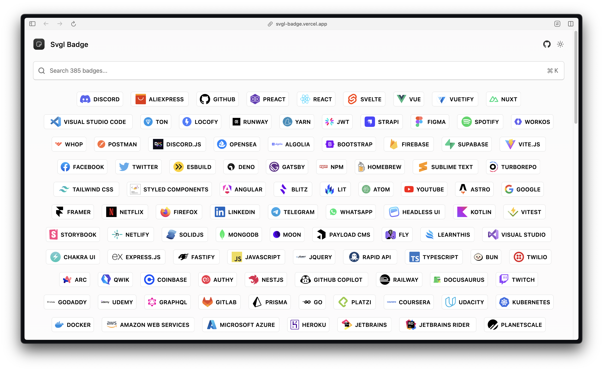

# Svgl Badges



The Markdown Badges for all the SVGs available on [Svgl](https://svgl.app).

## Stack

[](https://svgl.app)
[](https://github.com/ridemountainpig/svgl-badge)
[](https://vercel.com)
[](https://nextjs.org)
[](https://tailwindcss.com)

## Usage

1. Go to [Svgl Badge](https://svgl-badge.vercel.app) and search for the SVG you want to use. 
2. Click on the SVG and copy the URL. 
3. Use the URL in the following format:
```markdown
[](https://svgl.app)
```